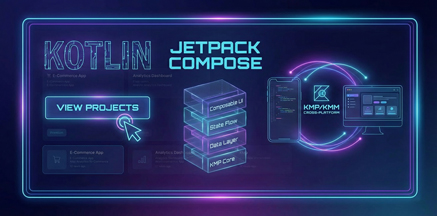
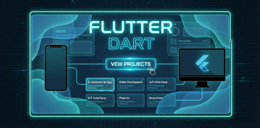
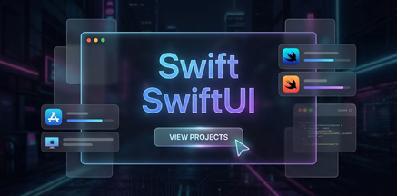

# 💫 About Me

📱 Mobile developer with experience in both Android and iOS platforms 💻 Proficient in Java, Kotlin, and Swift 🔄 Actively working on KMP (Kotlin Multiplatform) and KMM (Kotlin Multiplatform Mobile) 🕶️ Experience in building and publishing AR/VR applications (Vision Pro / Oculus Quest) 🎮 Experience in building mobile and VR games/ Apps using Unity 🚀 Passionate about cross-platform development and emerging technologies 📚 Always learning and exploring new tools to build better apps

## 🌐 Socials

  

# 💻 Tech Stack

       

# 📊 GitHub Stats

 
 

# 📂 Portfolio

### 🖱️ Click on a banner to see projects in that category

  <a href="./kotlin.md">
    <picture>
      <source media="(prefers-color-scheme: light)" srcset="./assets/kotlinLight.jpg">
      
    </picture>
  </a>
  <a href="./flutter.md">
    <picture>
      <source media="(prefers-color-scheme: light)" srcset="./assets/flutterLight.jpg">
      
    </picture>
  </a>
  <a href="./unity.md">
    <picture>
      <source media="(prefers-color-scheme: light)" srcset="./assets/unityLight.jpg">
      
    </picture>
  </a>
  <a href="./swift.md">
    <picture>
      <source media="(prefers-color-scheme: light)" srcset="./assets/swiftLight.jpg">
      
    </picture>
  </a>
  <a href="./arvr.md">
    <picture>
      <source media="(prefers-color-scheme: light)" srcset="./assets/arVrLight.jpg">
      
    </picture>
  </a>
  <a href="./python.md">
    <picture>
      <source media="(prefers-color-scheme: light)" srcset="./assets/pythonLight.jpg">
      
    </picture>
  </a>

