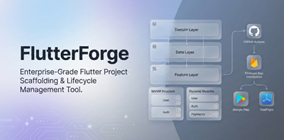

# FlutterForge

> A CLI tool that generates production-ready Flutter projects with pre-configured architecture, modules, and CI/CD pipelines.

  

## What is FlutterForge?

FlutterForge scaffolds Flutter projects with a clean, opinionated architecture out of the box. Instead of spending hours wiring up state management, dependency injection, routing, theming, API layers, and CI/CD pipelines, you run a single command and get a project that's ready for feature development.

It generates projects following **MVVM + Clean Architecture** with **Provider** for state management and **GetIt** for dependency injection. Every generated file follows consistent patterns — base view models, repository interfaces, use case layers, and feature-based folder structure.

Beyond initial scaffolding, FlutterForge manages the project lifecycle. You can add or remove modules after creation, and shared files (`main.dart`, `app.dart`, `locator.dart`) are automatically recomposed to reflect the current module set. The CI/CD wizard generates GitHub Actions workflows with deployment to Firebase App Distribution, Google Play Store, and Apple TestFlight.

### Key Capabilities

- **Interactive wizard** — guided project setup with module selection and organization/package name configuration
- **12 modules** — MVVM, logging, service locator, theming, routing, API client, AI service, localization, startup flow, toast notifications, testing, and CI/CD
- **Module lifecycle** — add and remove modules post-creation with automatic dependency resolution
- **CI/CD generator** — GitHub Actions with per-branch builds, Firebase distribution, Google Play upload, TestFlight deployment, auto-publish with release notes
- **Clean architecture** — domain/data/feature layers with repositories, use cases, and view models