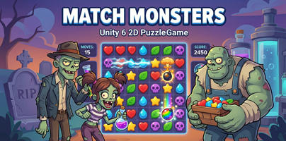

# Match Monsters

<div align="center">
  
</div>

## Private Project

This is a private project and its source code is not publicly available. Match Monsters was developed as a proprietary project, and access to the repository is restricted.

## Devlog

I'll be adding devlog entries about the development process of Match Monsters here. Meanwhile, you can read general information about the project below.


A 2D match-three puzzle game built with Unity 6.

Players swap adjacent chips to match 3+ of the same color, clear objectives within limited moves, and navigate obstacles like ice, boxes, line blockers, and containers.

## Requirements

- **Unity 6000.2.8f1** (Unity 6)
- Universal Render Pipeline (URP)

## Project Structure

```
Assets/
├── Scripts/
│   ├── Core/               # GameManager, BoardController, BoardState, MatchDetector, PowerupManager
│   ├── Gameplay/           # Chip, Powerup, SpecialItem, LineBlocker, FourCellBlocker
│   ├── Gameplay/Effects/   # BombEffect, ColorBombEffect, LineBlastEffect, MiniBombEffect
│   ├── Data/               # Enums, ChipObjective, GridCellData, MatchGroup
│   ├── Input/              # InputHandler (touch & mouse)
│   └── UI/                 # GameUI
├── ScriptableObjects/
│   ├── ChipTypes/          # 6 chip type definitions
│   ├── Powerups/           # 6 powerup type definitions
│   ├── SpecialObjects/     # 20+ special item definitions
│   ├── Levels/             # Level definitions
│   └── Config/             # GameSpeedConfigSO
├── Prefabs/
│   ├── Chips/              # Per-type chip prefabs (6)
│   ├── Powerups/           # Per-type powerup prefabs (5 + base)
│   ├── SpecialItems/       # Per-type special item prefabs (21)
│   └── Effects/            # VFX prefabs
├── Animation/Powerups/     # Animator Controllers for powerups
├── Art/Sprites/            # Sprite assets
├── Audio/                  # Music and SFX
├── Editor/LevelBuilder/    # Custom level editor tool
└── Scenes/                 # Gameplay.unity
```

## Architecture

### Data Model

The project uses a clean separation between data and visuals:

- **ScriptableObjects** define identity, behavior, and game logic (matching rules, effect patterns, gameplay flags)
- **Prefabs** own all visual configuration (sprites, animations, audio)

Each SO type has an `icon` field used only for UI (Level Builder, objectives). All gameplay sprites live on the MonoBehaviour components of prefab variants.

### Core Systems

| System | Responsibility |
|--------|---------------|
| **GameManager** | Game flow state machine, win/lose logic, objective tracking, hint system |
| **BoardController** | Board initialization, chip/powerup spawning, gravity, per-type object pooling |
| **BoardState** | Logical board grid (chips, powerups, special items), position lookups |
| **MatchDetector** | Match detection (3+ lines, 2x2 squares), powerup pattern identification |
| **PowerupManager** | Powerup creation mapping, effect activation, affected cell calculation |
| **InputHandler** | Touch and mouse input, piece selection, swap validation |

### Game Flow

```
Idle → PlayerInput → CheckingMatches → ClearingChips →
FillingBoard → ProcessingPowerups → [CheckingMatches] → GameOver
```

### Object Pooling

Per-type pooling using `Dictionary<TypeSO, Queue<Component>>`:

- Chips: 30 per type (pre-warmed from level's available chips)
- Powerups: 10 per type (lazy initialization)
- Special Items: 15 per type (lazy initialization)

Fallback to shared prefabs if no per-type prefab is assigned.

## Game Elements

### Chips (6 types)

Red, Blue, Green, Yellow, Orange, Purple. Each has a unique prefab with default sprite, glow sprite (for hints), and locked sprite (for containers).

### Powerups (6 types)

Created automatically when special match patterns are detected:

| Powerup | Created By | Effect |
|---------|-----------|--------|
| **Row Blast** | 4 in a row | Clears entire row |
| **Column Blast** | 4 in a column | Clears entire column |
| **Mini Bomb** | 2x2 square | Clears 3x3 area |
| **Bomb** | L-shape (5+) | Destroys self + 2 random cells |
| **Bomb T** | T-shape (5+) | Clears cross (row + column) |
| **Color Bomb** | 5+ in a line | Destroys 20% of available cells |

Powerups are independent of chip colors and activate when swapped with any adjacent piece. Animation uses a 3-tier fallback: Animator triggers, legacy AnimationClip, procedural coroutine.

### Special Items / Obstacles

| Type | Group | Behavior |
|------|-------|----------|
| **Box** (5 variants) | FillCell | Fills cell, no chip underneath, 1 HP |
| **Ice** (4 variants) | Overlay | Sits on top of chip, blocks matching |
| **Grass** | Overlay | Hides chip from matching |
| **Jelly** | Background | Behind chip, spreads to matched cells |
| **Coin** | Collectible | Fills cell, always 1 HP |
| **Dust** (2 variants) | FillCell | Solid obstacle, 1 HP |
| **Line Blocker** (6 variants) | LineBlocker | Blocks 2-7 cells vertically, slides down on hit |
| **Four Cell Blocker** | FourCellContainer | 2x2 container, opens to reveal 4 random chips |

## Level Design

### Level Builder

Open via **Tools > Level Builder** in the Unity Editor.

Features:
- Visual grid editor with paint tools
- Tabs for placing cells, chips, powerups, and special items
- Objective configuration (chip collection, special item destruction)
- Board dimensions (6x6 to 10x10), move limit, level number
- Pre-placement of specific pieces on the grid

### LevelDataSO

Each level defines:
- `gridWidth` / `gridHeight` - Board dimensions
- `maxMoves` - Move limit
- `availableChips` - Which chip types appear
- `availablePowerups` - Which powerups can be created
- `chipObjectives` - Win conditions (collect X chips or destroy Y items)
- `gridLayout` - Per-cell configuration (cell type, pre-placed pieces, HP)

### GameSpeedConfigSO

Global timing configuration with 19 parameters controlling swap speed, fall duration, cascade delays, animation durations, and a global speed multiplier (0-90% reduction).

## Adding New Content

### New Chip Type

1. Create ChipTypeSO asset: Right-click > Create > Match Kings > Chip Type
2. Set `chipID` (unique), `chipName`, `icon`, `chipColor`
3. Create prefab variant from base chip prefab
4. Configure SpriteRenderer sprite and color on the prefab
5. Set `_glowSprite` and `_lockedSprite` on the Chip component
6. Assign prefab to SO's `chipPrefab` field

### New Powerup Type

1. Create PowerupTypeSO asset: Right-click > Create > Match Kings > Powerup Type
2. Set `creationPattern` and `effectPattern`
3. Create prefab variant from base powerup prefab
4. Add Animator Controller with Idle/Enter/Activate states
5. Assign prefab to SO's `powerupPrefab` field

### New Special Item Type

1. Create SpecialItemTypeSO asset: Right-click > Create > Match Kings > Special Item Type
2. Set `group`, `defaultHitPoints`, `allowChipMatching`, `expandable`
3. Create prefab variant from base special item prefab
4. Configure `_hitSprites` array on the SpecialItem component
5. Assign prefab to SO's `itemPrefab` field

### New Level

1. Open **Tools > Level Builder**
2. Create new LevelDataSO or load existing
3. Configure grid size, moves, and available types
4. Paint the grid layout and set objectives
5. Save the asset
