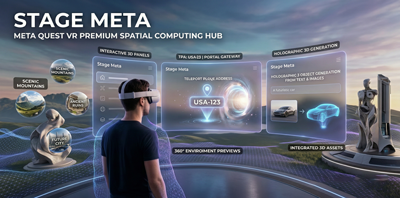

# Stage Meta

  
  

Stage Meta is the only Spatial Computing Ecosystem that allows businesses to effortlessly build their Immersive presence. It enables them to connect with premium customers and audiences, facilitating seamless and Impactful engagement in immersive spaces, delivering a truly transformative experience unlike anything before.

### Target Audiences
Enthusiasts who are keen on exploring and looking for new and exciting experiences and adventures enabled by advanced Spatial Computing.

Businesses across sectors such as Hotels & Hospitality, Real Estate, Construction, Retail, Entertainment and more want to stand out by creating unique immersive experiences for their customers without the complexities of coding. These entities use TPA as their unique address and gateway to build and showcase  their immersive environments to others.

### Functional Capabilities
- Effortless Login: Access your account with ease.
- Easy Search: Search by concept, keyword, or TPA (e.g., USA-123) to instantly teleport to a spatial environment.
- 3D Object Integration: Incorporate 3D objects into the virtual setting.
- Immersive 360° Views: Experience sites through static or dynamic immersive walkthroughs.

Join the Spatial Computing Revolution
With Stage Meta technology, businesses can seize the opportunity to lead their industry and leave the competition behind, while audiences experience a unique and immersive experience like never before.

# Made with Unity
# Released on [Meta Quest Store](https://www.meta.com/experiences/stage-meta/9186702211346400/?srsltid=AfmBOoqwa20BM11ku6fvSIZ_XvxZT6MJ3BByTfYLdZQusZGUkbLS40Ar)